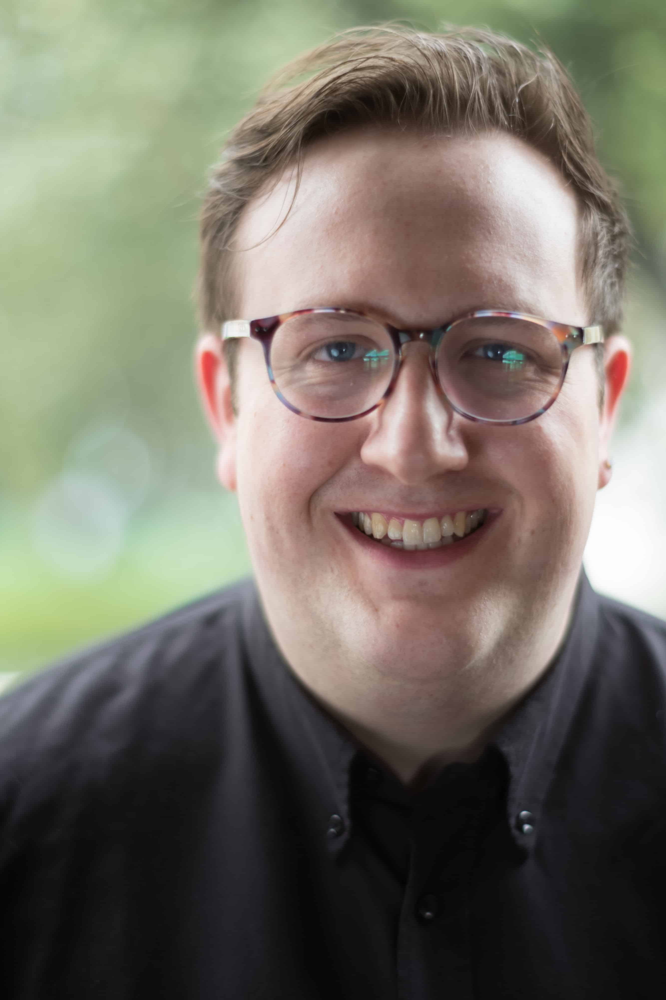

British baritone Hugo Herman-Wilson read Theology at King’s College, Cambridge before studying at the Royal College of Music. He won the Audience Prize in the 2017 Somerset Song Prize, received the Maidment Award from Help Musicians UK in 2016 and 2018 and was a Britten-Pears Young Artist for 2017, 2018 and 2019. He is a member of the 11th edition of Le Jardin des Voix, the young artist programme of William Christie’s Les Arts Florissants.

Operatic highlights include **Monsieur Presto** (Les Mamelles de Tirésias, cover) and **The Notary** (Don Pasquale, cover) for Glyndebourne Festival Opera, **Micha** (The Bartered Bride, cover) for Garsington Opera, **Dottore Grenvil** (La Traviata) and **Masetto** (Don Giovanni, cover) for Nevill Holt Opera, **Marcello** and **Scarpia** (La Bohéme, Tosca) staged in contemporary one-hour adaptations with Opera Undone at Trafalgar Studios, the role of **Mr Jedermann** (Scoring a Century, written by David Blake and Keith Warner) for British Youth Opera, and a recital of songs and duets by Purcell and Lawes with soprano Charlotte Bowden for the Aldeburgh Festival. As part of the Royal College of Music International Opera Studio, Hugo performed the roles of **Blazes/Second Officer** (The Lighthouse), **Peter Quince** (A Midsummer Night’s Dream), and **Polifemo** (Acis and Galatea).

As a concert soloist, recent performances have included a Wigmore Hall debut as part of their Family Concert series, recitals at the SmorgasChord and Aldeburgh festivals and performances of Bach with the Orchestra of the Age of Enlightenment at Kings Place, the Temple Music Foundation, and at Snape Maltings. 

Highlights of the current season include Dido and Aeneas at the Ustinov Studio in Bath, concerts with Figure Ensemble, a tour of Purcell's Fairy Queen with Les Arts Florissant and Bartolo (cover) with Garsington Opera.